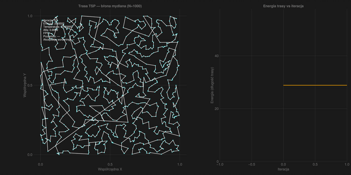

# JuliaCity

Wizualnie przekonująca, fizycznie umotywowana heurystyka TSP w idiomatycznej Julii — trasa „bańki mydlanej" zaciska się wokół 1000 punktów w czasie rzeczywistym i daje krótszą trasę niż naiwny baseline nearest-neighbor.



## Wymagania

- Julia ≥ 1.10 (zalecane: 1.11 lub 1.12)
- System: Linux / macOS / Windows
- GPU z OpenGL 3.3+ (dla okna GLMakie — patrz uwagi headless poniżej)

## Instalacja

W REPL Julii, w katalogu repo:

```julia
using Pkg
Pkg.activate(".")
Pkg.instantiate()
```

`Manifest.toml` jest commitowany (to aplikacja, nie biblioteka) — `instantiate` przypina dokładne wersje.

## Quickstart

Trzy fragmenty pokazujące pełen pipeline:

**(a) Generowanie 1000 punktów (deterministyczne dla danego seeda):**

```julia
using JuliaCity
punkty = generuj_punkty(1000; seed=42)
@assert length(punkty) == 1000
```

**(b) Live demo (otwiera okno GLMakie):**

```julia
using JuliaCity, Random
punkty = generuj_punkty(1000; seed=42)
stan = StanSymulacji(punkty; rng=Xoshiro(42))
inicjuj_nn!(stan)
alg = SimAnnealing(stan)
stan.temperatura = alg.T_zero
params = Parametry(liczba_krokow=50_000)
wizualizuj(stan, params, alg; liczba_krokow=50_000, fps=30, kroki_na_klatke=50)
```

Lub po prostu:

```bash
julia --project=. --threads=auto examples/podstawowy.jl
```

**(c) Eksport do GIF/MP4:**

```julia
wizualizuj(stan, params, alg; liczba_krokow=15_000, kroki_na_klatke=50, fps=30, eksport="moje_demo.gif")
```

Rozszerzenie `.gif` lub `.mp4` jest wykrywane automatycznie. Szablon w `examples/eksport_mp4.jl`.

## Algorytm

Symulowane wyżarzanie z ruchami 2-opt i metropolis acceptance, startujące od trasy nearest-neighbor (NN), z geometrycznym chłodzeniem (α = 0,9999) i auto-kalibrowaną temperaturą początkową `T₀ = 2σ(Δ-energii)` (próbkowanie 1000 ruchów pogarszających przed startem).

Metafora błony mydlanej: krawędzie trasy zachowują się jak elastyczne membrany pod napięciem powierzchniowym — w każdej iteracji algorytm „zaciska" jedną z par krawędzi (ruch 2-opt) i akceptuje nową trasę z prawdopodobieństwem `exp(−Δ/T)`. W trakcie chłodzenia (`T → 0`) akceptowane są tylko ulepszenia, więc trasa zbiega do minimum lokalnego 2-opt.

Architektura jest rozszerzalna — `abstract type Algorytm` + Holy-traits dispatch pozwala dodać warianty `ForceDirected` i `Hybryda` w v2 bez zmiany API.

## Benchmarki

Pełne wyniki (czas, alokacje, jakość trasy): [`bench/wyniki.md`](bench/wyniki.md).

**Headline:** SA znajduje trasę średnio ~4% krótszą niż NN baseline (5 seedów × N=1000 × 50 000 kroków).

Reprodukcja (wrapper — załatwia BenchmarkTools w `[targets].test`, patrz `bench/uruchom.{sh,ps1}`):

```bash
bash bench/uruchom.sh        # POSIX (Linux/macOS/WSL)
pwsh bench/uruchom.ps1       # PowerShell (Windows)
```

Suite zawiera:

- `bench/bench_energia.jl` — czas + alokacje `oblicz_energie` (3-arg, threaded)
- `bench/bench_krok.jl` — czas + alokacje `symuluj_krok!` (jeden krok SA-2-opt + Metropolis)
- `bench/bench_jakosc.jl` — ratio `SA / NN` na 5 seedach (D-08 lock)

Pliki `bench/historyczne/` zawierają empiryczną diagnostykę z Phase 2 — patrz [`bench/historyczne/README.md`](bench/historyczne/README.md).

## Struktura projektu

```
JuliaCity/
├── src/                    # Kod źródłowy: typy, energia, SA, baselines, wizualizacja
│   ├── JuliaCity.jl         # Moduł główny + eksport publicznego API
│   ├── typy.jl              # Punkt2D, StanSymulacji, Algorytm, Parametry
│   ├── punkty.jl            # generuj_punkty (deterministyczny RNG)
│   ├── energia.jl           # oblicz_energie + delta_energii + kalibruj_T0
│   ├── baselines.jl         # NN init (trasa_nn, inicjuj_nn!)
│   ├── algorytmy/           # Warianty <:Algorytm (Holy-traits)
│   │   └── simulowane_wyzarzanie.jl
│   └── wizualizacja.jl      # GLMakie + Makie.record (jedyny plik z `using GLMakie`)
├── test/                    # Test suite (230+ testów: encoding, type stability, zero-alloc, NN-beat)
├── examples/                # Skrypty demo: live + eksport GIF
├── bench/                   # Benchmarki: energia, krok, jakość + run_all orchestrator
├── assets/                  # Demo GIF (commitowany)
├── .planning/               # Pamięć projektu (GSD workflow — STATE/ROADMAP/REQUIREMENTS)
├── Project.toml             # Deps + compat
├── Manifest.toml            # Pinned versions (commitowany — to aplikacja)
├── CONTRIBUTING.md          # Konwencje (encoding, ASCII, polski/angielski split, typografia)
└── LICENSE                  # MIT
```

## Licencja

MIT — patrz [`LICENSE`](LICENSE).
